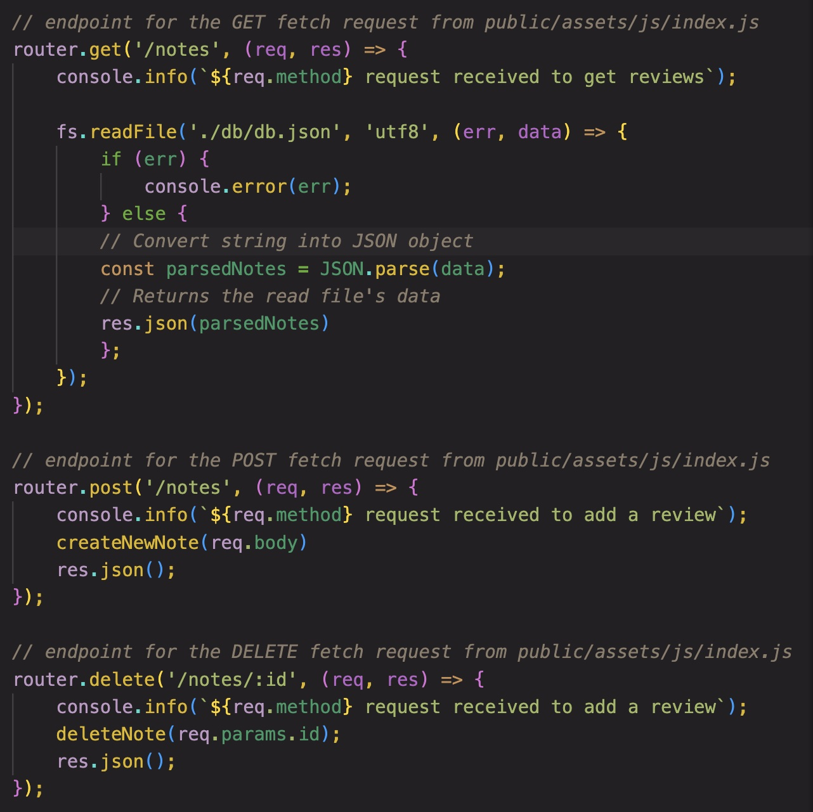

# taking-some-notes
## Project Description
This challenge exercised our knowledge using express.js to create a server. We used this server to host a note taker that saves user-input notes and allows the user to revisit them later. We achieved this through the use of GET, POST, and DELETE api request.
 
 

---
## Table of Contents
* [Installation Instructions](#installation)
* [Usage](#usage)
* [Contact Information](#contact)

---

 

## -=Installation=-
Before running the program, install the *Express.js* and *uuid* npm dependencies with:

npm i

Express.js is the dependency used to configure our api routes and request, while UUID is used to individually assign an ID to notes for easily handling.

 

## -=Usage=-
To run the code locally, type *node index.js* in the command line of the root directory and click the local host url produced. The application has also been deployed to heroku for remote access.

The app utilizes api routes with GET, POST, and DELETE request. The GET is used to update the saved notes list for the user, pulling information from the db/db.json data. The POST request occurs when the user saves their note. It writes the user input to the db/db.json data and attributed a unique ID to it using the UUID. Lastly, the DELETE request utilizes this unique ID to target specific notes when the delete icon is selected.

## -=Contact=-
Check out the deployed [Heroku](https://frozen-river-62484.herokuapp.com/) page for this project and check out my other work on my [GitHub](https://github.com/AHudg).

Made by Andrew Hudgins :)